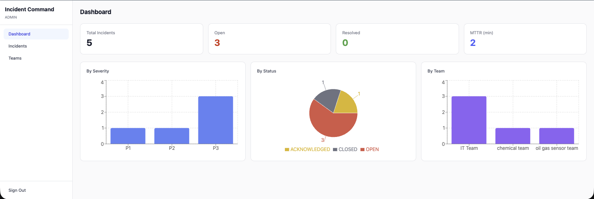
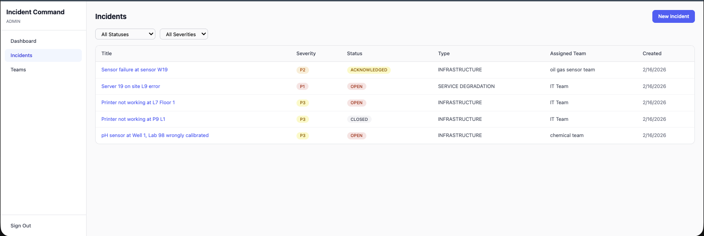
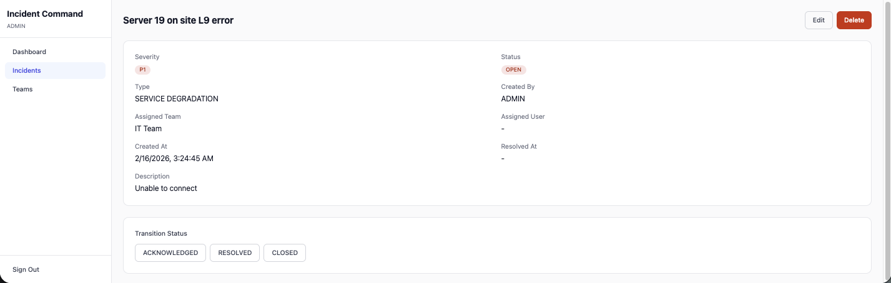
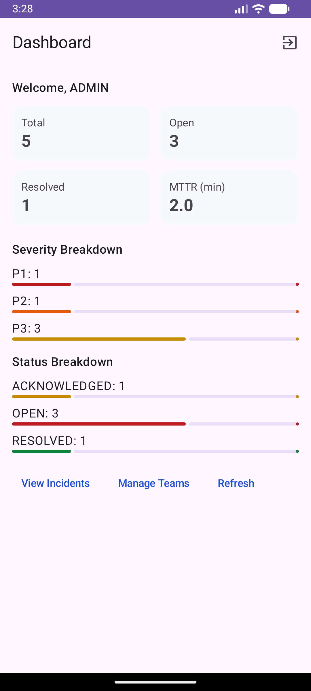
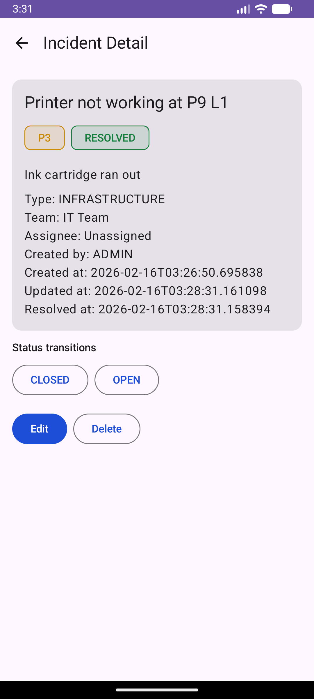

# Incident Command

A full-stack incident management platform with a Spring Boot REST API, React web dashboard, and Android mobile app. Built to demonstrate end-to-end software engineering across backend, web, and mobile — with JWT authentication, role-based access control, real-time metrics, and offline caching.

## Screenshots

### Web Dashboard
<p align="center">
  
</p>
<p align="center">
  
</p>
<p align="center">
  
</p>

### Mobile App
<p align="center">
  
  
  
</p>

## Tech Stack

| Backend | Web | Android |
|---------|-----|---------|
| Java 17, Spring Boot 3 | React 19, TypeScript | Kotlin, Jetpack Compose |
| Spring Security + JWT | Tailwind CSS | Material 3 |
| JPA + Flyway (PostgreSQL / H2) | Axios, React Router | Retrofit 2, Room |
| MapStruct, Lombok | Recharts | Hilt, EncryptedSharedPreferences |
| 99 unit + integration tests | Vite | MVVM + Repository pattern |

## Architecture

```
┌──────────┐     ┌──────────────┐     ┌──────────────┐
│  React   │────▶│              │◀────│   Android    │
│   Web    │     │  Spring Boot │     │     App      │
│Dashboard │     │   REST API   │     │  (Compose)   │
└──────────┘     │              │     └──────────────┘
                 │  JWT Auth    │            │
                 │  RBAC        │         Room DB
                 │  Metrics     │       (offline cache)
                 └──────────────┘
                       │
                  PostgreSQL / H2
```

Three roles control access: **ADMIN** (full access + teams), **RESPONDER** (incident CRUD), **VIEWER** (read-only).

## Getting Started

### Backend
```bash
cd backend
./gradlew bootRun          # starts on http://localhost:8080
./gradlew test             # runs 99 tests
```
Dev profile uses in-memory H2 — data resets on restart.

### Web Dashboard
```bash
cd web
npm install
npm run dev                # starts on http://localhost:5173
```

### Android
Open `android/` in Android Studio, run on emulator (API 26+).
The app connects to `http://10.0.2.2:8080/api` (emulator localhost).

## API Endpoints

| Method | Endpoint | Auth | Description |
|--------|----------|------|-------------|
| POST | `/api/auth/login` | Public | Login, returns JWT |
| POST | `/api/auth/register` | Public | Register new user |
| GET | `/api/incidents` | All roles | List all incidents |
| POST | `/api/incidents` | Admin, Responder | Create incident |
| PUT | `/api/incidents/{id}` | Admin, Responder | Update incident |
| PATCH | `/api/incidents/{id}/status` | Admin, Responder | Transition status |
| DELETE | `/api/incidents/{id}` | Admin | Delete incident |
| GET | `/api/metrics` | All roles | Dashboard metrics |
| GET | `/api/teams` | Admin | List teams |
| POST | `/api/teams` | Admin | Create team |

## Project Structure

```
incident-command/
├── backend/       # Spring Boot API (Java 17)
├── web/           # React + TypeScript dashboard
└── android/       # Kotlin + Jetpack Compose app
```
